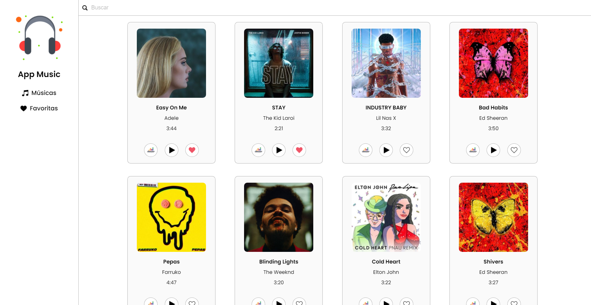
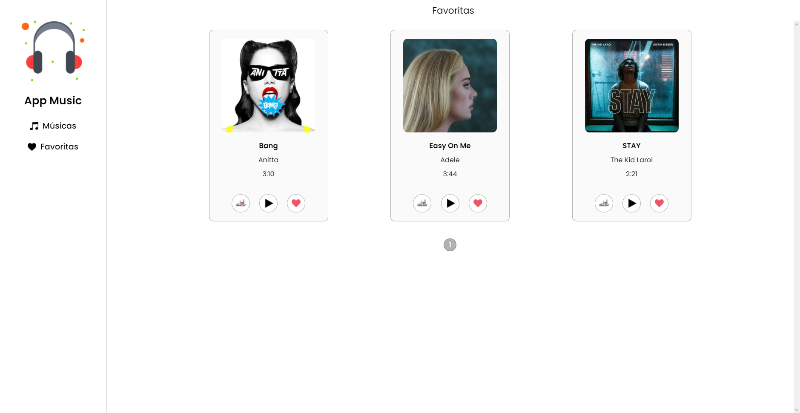
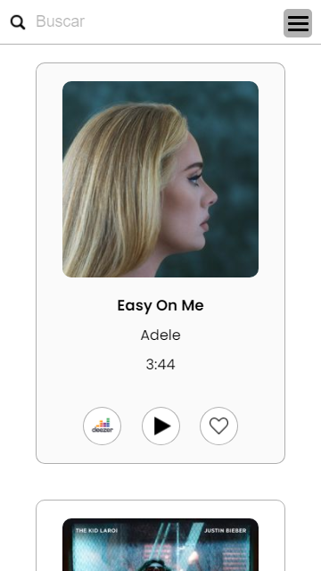
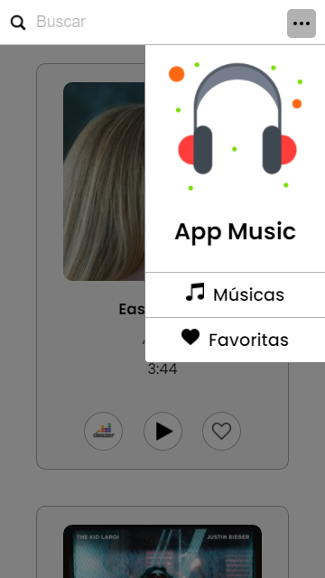

# 💻 APP MUSIC

---

## 🗒️ Sobre o projeto

App music é um webapp que utiliza a api do deezer.  Na tela inicial é exibida a lista das principais músicas do momento (no deezer). 
Cada música é exibida num card com a foto do album, nome do artista, tempo e nome da mesma, além de três botões; um que redireciona o usuário
pro site do deezer numa nova aba com as informações da respectiva música, outro que da play/stop e o último que adiciona a música na view das favoritas (as músicas ficam salvas no local storage através do Redux Persist, podendo assim atualizar a página que a informação não será perdida).
É possível deletar as músicas da lista de favoritas na página das favoritas. Todas as músicas favoritadas estão sinalizadas com um "coração rosa".
Existe também um campo de pesquisa, seja pesquisa de música, nome do artista ou album, será exibido as músicas relacionadas ao texto pesquisado.   

---

## 💡 Instalação e execução

- Tenha o git e npm instalados.
- Com o terminal aberto, digite "git clone urlDoRepositório" e baixe o mesmo.
- Depois de baixado, ainda no terminal, abra o repositório "cd nomeDoRepositório".
- instale as dependências com "npm install".
- Ao final da instalação, basta digitar "npm start" e o app abrirá no seu localhost.
- O comando "npm run build" vai gerar o app na pasta "build", já otimizado e pronto para deploy.

---

## 🛠 Tecnologias

### Frontend:

- HTML
- CSS
- JavaScript
- ReactJS
- Styled Components
- Redux
- Redux Persist

---

## 🎨 Screens

### Web

  <b>HOME - TOP MÚSICAS DEEZER</b>
  

  <b>FAVORITAS - MÚSICAS FAVORITAS DO USUÁRIO</b>
  

### Mobile

<b>VERSÃO MOBILE COM MENU FECHADO / MENU ABERTO</b>

  
  

